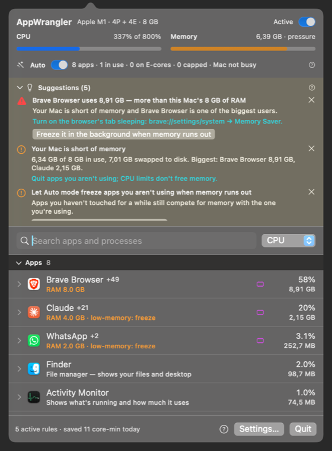
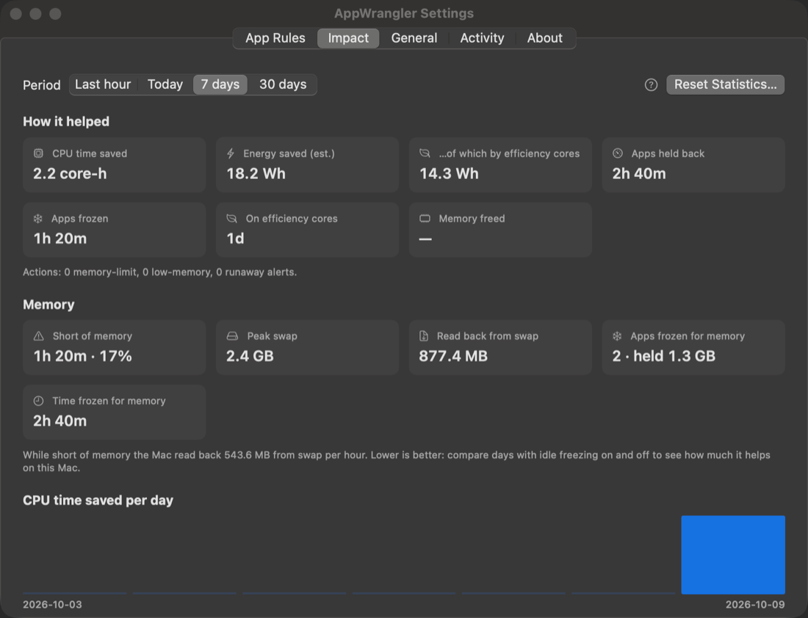
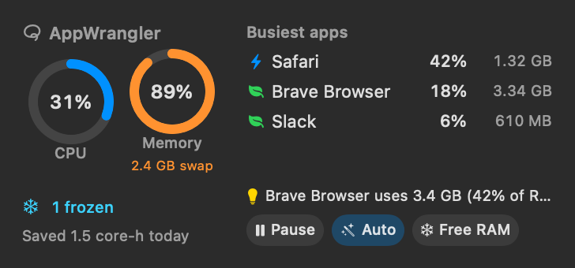
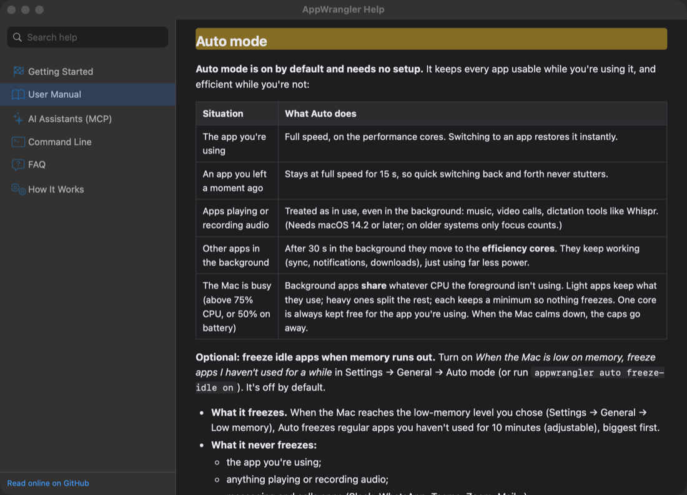

# AppWrangler User Manual

Everything AppWrangler does, and every setting, explained. New here? Start with [Getting Started](getting-started.md).

This manual is also built into the app (no internet needed). Open it from the **?** button in the panel, **Help & Documentation** in the menu bar icon's right-click menu, the **?** next to any setting, or **⌘?** in an AppWrangler window. See [Help inside the app](#help-inside-the-app).

- [Key ideas](#key-ideas)
- [Auto mode](#auto-mode)
- [The menu bar panel](#the-menu-bar-panel)
- [The main window](#the-main-window)
- [Rules](#rules)
  - [Only while the app is in the background](#only-while-the-app-is-in-the-background)
  - [Limit CPU](#limit-cpu)
  - [Efficiency cores only](#efficiency-cores-only)
  - [Memory limit](#memory-limit)
  - [When the Mac is low on memory](#when-the-mac-is-low-on-memory)
  - [When to apply (conditions)](#when-to-apply-conditions)
  - [Helper processes](#helper-processes)
  - [Ignoring an app](#ignoring-an-app)
  - [How rules are matched](#how-rules-are-matched)
- [Freeze, quit and force quit](#freeze-quit-and-force-quit)
- [Free memory now](#free-memory-now)
- [Pausing all limits](#pausing-all-limits)
- [Runaway alerts](#runaway-alerts)
- [Impact: how much it helped](#impact)
- [Desktop widget](#desktop-widget)
- [Suggestions: what to change](#suggestions-what-to-change)
- [Every setting of an app](#every-setting-of-an-app)
- [Asking an AI assistant](#asking-an-ai-assistant)
- [Help inside the app](#help-inside-the-app)
- [Links: appwrangler://](#links-appwrangler)
- [Settings window](#settings-window)
- [Safety](#safety)
- [Where your data lives](#where-your-data-lives)

---

## Key ideas

**CPU percentages are per core.** As in Activity Monitor, 100% means one CPU core fully busy. An 8-core Mac has 800% in total, so a limit of 50% means "half of one core" and 200% means "two cores' worth".

**Apps are measured together with their helpers.** Modern apps run as many processes. Chrome and Electron apps (Slack, Discord, VS Code…) start a renderer per window or tab, and Safari's web pages run as separate *WebContent* processes. AppWrangler folds these into the app they belong to: the **+N** next to a name is the number of helpers. Limits and memory figures cover the whole group, unless you turn off [helper processes](#helper-processes).

**Rules follow the app.** A rule is saved for the app, not for one running copy. It applies immediately, again every time the app launches, and after you restart your Mac. Rules are matched by bundle ID (for apps), path, process name, or a name pattern.

**Nothing needs a restart.** Changing a rule in the panel, in Settings, from the [command line](cli.md), or by editing `rules.json` takes effect within about half a second. So do switching apps, plugging in or unplugging, Low Power Mode, the Mac heating up, and memory pressure changing.

---

## Auto mode

**Auto mode is on by default and needs no setup.** It keeps every app usable while you're using it, and efficient while you're not:

| Situation | What Auto does |
|---|---|
| The app you're using | Full speed, on the performance cores. Switching to an app restores it instantly. |
| An app you left a moment ago | Stays at full speed for 15 s, so quick switching back and forth never stutters. |
| Apps playing or recording audio | Treated as in use, even in the background: music, video calls, dictation tools like Wispr Flow. (Needs macOS 14.2 or later; on older systems only focus counts.) |
| Other apps in the background | After 30 s in the background they move to the **efficiency cores**. They keep working (sync, notifications, downloads), just using far less power. |
| The Mac is busy (above 75% CPU, or 50% on battery) | Background apps **share** whatever CPU the foreground isn't using. Light apps keep what they use; heavy ones split the rest; each keeps a minimum so nothing freezes. One core is always kept free for the app you're using. When the Mac calms down, the caps go away. |

**Optional: freeze idle apps when memory runs out.** Turn on *When the Mac is low on memory, freeze apps I haven't used for a while* in Settings → General → Auto mode (or run `appwrangler auto freeze-idle on`). It's off by default.

- **What it freezes.** When the Mac reaches the low-memory level you chose (Settings → General → Low memory), Auto freezes regular apps you haven't used for 10 minutes (adjustable), biggest first.
- **What it never freezes:**
  - the app you're using;
  - anything playing or recording audio;
  - apps still doing work (using more than 5% CPU), and small ones (under 100 MB);
  - messaging and calls apps (Slack, WhatsApp, Teams, Zoom, Mail…);
  - terminals, code editors and IDEs, and virtual machines and containers (Docker, UTM, Parallels…), whose jobs, builds and servers would stop;
  - menu bar apps;
  - apps you've told AppWrangler to ignore, or whose own rule already has a low-memory action;
  - anything while limits are [paused](#pausing-all-limits).
- **Why it helps.** Frozen apps stop pulling their memory back in, so macOS can compress or swap it out and the app in front stays responsive.
- **Getting them back:**
  - An app **resumes the moment you switch to it**.
  - All of them resume once memory has been fine for a minute. The delay stops them from freezing and thawing over and over when memory hovers at the limit.
  - They also resume as soon as you turn this setting (or Auto mode) off.
- **Effect.** On a Mac with little RAM this does more than any CPU setting. To free memory right away, whatever the pressure, use [Free memory now](#free-memory-now).

So AppWrangler adapts to **how many apps you're running and how hard they work**. With little running, nothing is held back. With a lot going on, the apps in the background share fairly, and the one in front stays fast.

The panel header shows what Auto is doing, e.g. *"Auto · 12 apps · 1 in use · 9 on E-cores · 0 capped · Mac not busy"*. Each row says how Auto is treating that app (*"Auto · efficiency cores (in background)"*).

**Auto and your own rules:**
- An app with its own **CPU limit** or **Efficiency cores** setting follows that rule; Auto leaves it alone.
- A rule with only memory or low-memory settings still lets Auto handle the app's CPU.
- To keep Auto away from an app completely, give it a rule and turn on **Ignore this app**.
- Plain processes (command-line tools, builds) and macOS services aren't managed by Auto.

Settings → General → **Auto mode** lets you change:
- the 30 s delay;
- whether background apps use efficiency cores;
- whether the CPU is shared when the Mac is busy, and above which load;
- whether idle apps are frozen when memory runs low, and after how long.

The same settings are available from the command line (`appwrangler prefs`) and to AI assistants.

The **Auto** switch in the panel header turns it off; `appwrangler auto on|off` works too.

> **Tip:** prefer Auto over fixed limits for everyday apps. A fixed limit like "Slack 25%" applies even while you use Slack (unless *Only while the app is in the background* is on) and makes it feel broken. Auto gives you the efficiency without the slowness.

---

## The menu bar panel

Click the menu bar icon. The panel is a quick overview; for the full list of apps, click **All apps** to open the [main window](#the-main-window).



| Area | What it shows |
|---|---|
| Header | The chip and core layout (e.g. *4P + 4E*), an **Active / Paused** switch, the **Auto** switch with what Auto is doing (apps managed, in use, on efficiency cores, frozen, whether the Mac is busy), and a line when you're on battery, in Low Power Mode, or the Mac is hot. |
| Charts | The last 10 minutes of CPU and memory. The CPU chart has a dashed green line for the share used by apps on efficiency cores. The memory chart is shaded while the Mac was short of memory. |
| Cards | Something AppWrangler just did, with a way to set that app up by hand (see below). |
| Suggestions | A line with the number of [suggestions](#suggestions-what-to-change) and the first one. Click it to see and apply them in the main window. |
| Busiest apps | The five apps using the most CPU, with what Auto or a rule is doing to each. Click one to open it in the main window. |
| Recently | The last three things AppWrangler did. The full list is in Settings → Activity. |
| Footer | CPU time saved today, **All apps**, **?** (Help), the gear for **Settings…**, and **Quit**. |

**Cards.** When AppWrangler does something on its own, the panel shows a card. It's shown for 30 seconds from when you see it, and the event stays in **Recently** afterwards. Cards appear when:

- Auto froze an idle app because memory ran low;
- an app's own [memory limit](#memory-limit) or low-memory setting froze, quit or warned about it;
- a background app used a lot of CPU for a while ([runaway alert](#runaway-alerts)).

The buttons:

- **OK** leaves things as they are. Auto stays in charge.
- **Set manually…** opens the app in the main window with its settings ready to edit.
- **Leave *app* alone** (for Auto's own actions) keeps the app out of Auto mode, as [ignoring it](#ignoring-an-app) does. If the app was frozen, it's resumed. `appwrangler undo` reverts it.
- For a runaway app that Auto doesn't manage, **Limit 50%** and **E-cores** create a rule right away.

By default, nothing needs a click: everything is handled by Auto mode.

---

## The main window

The main window has the full list of apps, with the details and settings of each. Open it with **All apps** in the panel, with *Open in a Window* in the menu bar icon's right-click menu, or by clicking an app under **Busiest apps** or **Set manually…** on a card (the app is then expanded for you).

| Area | What it shows |
|---|---|
| Header | Chip and core layout, total CPU, memory used and memory pressure, an **Active / Paused** switch and the **Auto** line. A line appears when you're on battery, in Low Power Mode, or the Mac is hot. |
| Alerts | Orange banner with [runaway alerts](#runaway-alerts), if any. |
| Suggestions | Yellow section with [recommended settings](#suggestions-what-to-change) for what's running. Each has one-click buttons to apply it, and **×** hides it for a week. Click the header to collapse it. |
| Search | Matches names, bundle IDs and descriptions. Try "browser", "sync" or "Spotlight". |
| Sort | By CPU, Memory, Energy or Name. Rows don't reorder while your pointer is over the list or a row is open, so they don't jump around. |
| Sections | **Apps**, **Menu bar & background apps**, **macOS system services**, **Processes**. Click a header to collapse or expand it. Searching shows matches in every section. |
| Footer | Number of active rules and CPU time saved today, **?** (Help), **Settings…**, **Quit**. |

The window is resizable and stays open, like Activity Monitor.
- While it's open, AppWrangler shows a Dock icon and appears in ⌘-Tab.
- If you quit AppWrangler with the window open, it reopens next time.
- The menu bar panel keeps working as before.

**Row badges:**

| Badge | Meaning |
|---|---|
| Gauge (orange) | CPU limit active (grey while paused) |
| Leaf (green) | Running on efficiency cores only |
| Memory chip (purple) | Memory limit set |
| Snowflake (cyan) | Frozen |
| Warning (yellow) | Can't be controlled (belongs to another user) |

**Click a row** to open its details:

- **What it is:**
  - the kind (App, Background app, macOS service, Process) and the vendor;
  - a description;
  - a safety note: *Safe to limit*, *Limit with care*, or *Critical to macOS*;
  - the bundle ID and path. You can select and copy them.
- **Live stats:** CPU, memory, energy (watts), disk read/write per second, threads.
- **Chart:** CPU and memory over the last 10 minutes, with peaks. History is collected while AppWrangler is measuring the app: apps with rules, every app while Auto mode is on, and everything while the panel or window is open.
- **Throttling status**, e.g. *"Throttling: using 25%, allowed to run 12% of the time"*.
- **The rule editor** (described below) and buttons for **Freeze**, **Quit**, **Force Quit** and **Remove Rule**.
- **Processes (N):** every process in the group, with its own CPU and memory.

**Right-click a row** for quick actions:
- *Limit CPU → 10/25/50/100/200%*, or *No CPU limit*;
- *Efficiency cores only*;
- *Freeze/Unfreeze*, *Quit*, *Force Quit*;
- *Remove Rule*;
- *Show in Finder*, *Copy Name*.

---

## Rules

### Only while the app is in the background

**On by default for new rules.** The rule's CPU limit and efficiency-core setting apply only while the app isn't the one you're using. When you bring it to the front it runs at full speed on the performance cores; when you switch away, the rule applies again. Turn it off only for apps you never want at full speed. The editor warns that this can make them feel slow.

### Limit CPU

Caps the app's combined CPU use. Choose anything from 1% up to 100% × the number of cores, using the slider, the number field, or the preset buttons.

How it works: AppWrangler lets the app run for part of each short cycle (50 ms by default) and pauses it for the rest, adjusting the split continuously to hit your target. A heavily limited app may feel less smooth; if that bothers you, try *Efficiency cores only* instead.

### Efficiency cores only

Puts the app in macOS's *background* scheduling class. On Apple Silicon this runs it on the efficiency cores and slows its disk and network access.

- The app is **never paused**, so it stays responsive, just slower at heavy work.
- It's great for sync clients, updaters, chat apps and build tools.
- It combines well with a CPU limit.
- It's undone automatically when you remove the rule or quit AppWrangler.

### Memory limit

macOS doesn't let one app hard-cap another's memory. Instead, AppWrangler watches the app's **memory footprint** (the "Memory" column in Activity Monitor) and acts when it stays above your limit for two measurements in a row, so a brief spike doesn't count:

| Action | What happens |
|---|---|
| Notify me | A notification and an Activity log entry |
| Freeze (suspend) | The app and its helpers are suspended until you unfreeze them |
| Quit app | Asks the app to quit normally, as Quit from the Dock would |
| Force quit | Ends it immediately. Unsaved work is lost |

The action happens once each time the app goes over the limit. It can trigger again after memory drops below 90% of the limit.

### When the Mac is low on memory

Separate from the per-app limit: this decides what happens to an app when **the whole Mac** runs short of memory, i.e. when macOS reports memory pressure.

- **Freeze until memory frees up** suspends the app while pressure is high, and resumes it automatically when it eases.
- The app you're using, and any app playing or recording audio, is never frozen or quit for this. Only background apps are.
- **Quit app** quits it once.

By default this happens at *critical* pressure. In Settings → General you can make it happen earlier, at *warning* pressure.

### When to apply (conditions)

Open **When to apply** to restrict when a rule is in force:

| Condition | Example use |
|---|---|
| Power: *Only on battery* / *Only when plugged in* | Keep Dropbox on E-cores only when unplugged |
| Only in Low Power Mode | Tighten everything when you've switched Low Power Mode on |
| Only when the Mac is hot | Limit a game or render job when the Mac reports serious thermal pressure |
| Only during these hours | Throttle Slack 09:00–17:00 on weekdays. Windows can cross midnight (e.g. 22:00–06:00), and the early-morning part counts as the previous day |

All the conditions you turn on must hold. Rules switch the moment a condition changes, e.g. when you pull the charger. If a rule is waiting for its conditions, the app's detail view says so.

### Helper processes

**Include helper processes** (on by default) applies limits, efficiency mode and memory accounting to the app's renderers, XPC services and other helpers too. Turn it off to affect only the main process.

### Ignoring an app

**Ignore this app in suggestions and automatic actions** keeps an app out of [runaway alerts](#runaway-alerts), [suggestions](#suggestions-what-to-change) and **Auto mode** (including idle freezing), and switches off all of its limits, without deleting the rule. *Ignore this app* on a runaway notification does the same thing.

### How rules are matched

When more than one rule could apply, the most specific wins: **bundle ID → path → process name → name pattern**.

- Rules created from the panel use the bundle ID for apps, and the path or name for plain processes. Process names are matched without regard to case.
- In Settings you can add a **name pattern** such as `*Helper*` or `com.google.*`:
  - `*` matches anything and `?` matches one character;
  - case is ignored;
  - the pattern is checked against names and bundle IDs.

---

## Freeze, quit and force quit

- **Freeze** suspends the app and all its helpers immediately. It uses no CPU while frozen; its memory stays allocated, and macOS can compress it. **Unfreeze** resumes it exactly where it was. A frozen app shows a spinning cursor if you click its windows; that's expected.
- **Quit** asks the app to quit normally, so it can save. AppWrangler first lifts any limit, so the app can respond.
- **Force Quit** ends it immediately, after asking you to confirm (from the right-click menu or the details view).

**When a freeze ends:**
- [Pausing](#pausing-all-limits) deliberately does *not* undo freezes.
- **Any freeze** ends when you unfreeze the app, when it quits, or when AppWrangler quits.
- **Low-memory and [Free memory](#free-memory-now) freezes** also end the moment you switch to the app, or when it plays audio.
- **Low-memory freezes** also end once memory has been fine for a minute.
- **A freeze AppWrangler made because of a setting** ends as soon as that setting no longer asks for it. Examples: you remove or disable a memory-limit rule, change its action from *Freeze*, or turn off low-memory freezing.

AppWrangler never freezes a command running in a terminal's foreground, because the shell would treat it as suspended.

---

## Free memory now

**Free memory** freezes the apps you haven't used for a while, right now, whatever the memory pressure. It applies the same rules as [Auto's idle freezing](#auto-mode): the idle time (10 min by default), and never the app in use, audio, busy apps, messaging and calls apps, terminals and IDEs, virtual machines or menu bar apps. Each app **resumes the moment you switch to it**.

Use it when the Mac starts swapping and you want the app in front to have the memory:
- the **Free memory** button on the [widget](#desktop-widget);
- `appwrangler free-memory`;
- the [link](#links-appwrangler) `appwrangler://free-memory`;
- or ask your AI assistant (`free_memory`).

What was frozen is listed in Settings → Activity and in `appwrangler status`.

---

## Pausing all limits

Use the **Active/Paused** switch in the header, *Pause All Limits* in the right-click menu, the widget's **Pause** button, `appwrangler pause`, or **⌃⌥⌘P** from anywhere. This lets every CPU-limited app run freely until you resume. Apps that are already frozen stay frozen, and nothing new is frozen while paused. The menu bar icon dims while paused.

---

## Runaway alerts

When an app **you haven't made a rule for** averages more than 80% CPU (adjustable) for 3 minutes (adjustable) while **not in front**, AppWrangler shows a card in the panel and an orange alert at the top of the main window, with **Limit 50%**, **E-cores** and **×** (dismiss for an hour). If Auto already manages the app, the card offers **Set manually…** and **Leave *app* alone** instead. It also sends a notification with three buttons:

- **Limit to 50%** creates a CPU-limit rule.
- **Use efficiency cores** creates an efficiency-cores rule.
- **Ignore this app** creates a rule that [ignores](#ignoring-an-app) it: no more alerts, and Auto mode leaves it alone too.

Each app is flagged at most once an hour. `appwrangler undo` reverts what these buttons did. Turn alerts off, or change the thresholds, in Settings → General → Runaway apps. While alerts are on, AppWrangler does a light scan every 5 seconds in the background, costing about 0.2% of one core.

---

## Impact



**Settings → Impact** shows what AppWrangler has achieved, and what it cost to run, for the **Last hour**, **Today**, **7 days** or **30 days**. The same numbers are available from `appwrangler stats` and the [MCP server](mcp.md). The panel footer shows "saved … today".

**How it helped:**

| Number | How it's measured |
|---|---|
| **CPU time saved** | While an app is held back, the limiter measures how much CPU it *wanted* and how much it *got*; the difference adds up. A frozen app is credited with the CPU it was using when frozen. Shown in core-minutes or core-hours (1 core-hour = one core busy for an hour). |
| **Energy saved (est.)** | Two parts. **Limits and freezes:** CPU saved × that app's own measured watts per core (1.5 W/core until it's been measured). **Efficiency cores:** the energy apps used while on the E-cores × 3.5. That's because the same work takes about 4.5× the energy on performance cores (5.3 J vs 1.16 J for a fixed workload, measured on an M1). On a MacBook it's also shown as a share of a full battery. |
| **Apps held back** | Time apps wanted more than their limit. |
| **Apps frozen / on efficiency cores** | Time spent in those states. |
| **Memory freed** | Memory released by memory-limit *Quit/Force quit* actions. |
| **Actions** | Memory-limit actions, low-memory actions and runaway alerts. |

A daily bar chart shows CPU time saved per day.

**Memory:** how your Mac's memory fared, and what was frozen because of it:

| Number | Meaning |
|---|---|
| **Short of memory** | Time memory pressure was at *warning* or worse, and the share of the measured time |
| **Peak swap** | The most swap in use at once |
| **Read back from swap** | Data macOS had to read back from disk because memory was short. This is what makes a Mac feel sluggish; lower is better |
| **Apps frozen for memory** | How many apps were frozen because of memory (low memory, idle freezing, [Free memory now](#free-memory-now)), and how much memory they held |
| **Time frozen for memory** | How long those apps stayed frozen, added up |

The figure to watch is **swap read back per hour while short of memory**. Try a few days with [idle freezing](#auto-mode) on and a few with it off: if the number drops with it on, freezing idle apps is helping your Mac.

**What AppWrangler cost:**
- its average CPU use and total CPU time;
- its memory (average and peak);
- **limit accuracy:** how closely held-back apps stayed at their limit, e.g. ±1.5%;
- an **efficiency ratio:** "saved N× more CPU time than it used".

These are measured while AppWrangler is watching or limiting apps, which with Auto mode on is all the time. With Auto and runaway alerts off and no rules, it doesn't sample at all.

**Per app:**
- CPU and energy saved;
- average **wanted → allowed** CPU;
- time held back and frozen.

Statistics are kept for 35 days in `stats.json` next to your rules, and are written every 30 seconds and on quit. **Reset Statistics…** clears them.

> These are estimates. "Wanted" comes from the limiter's measurement of how much the app uses whenever it's allowed to run. An app that would have finished its work sooner isn't modelled, so treat the numbers as a good indication rather than an exact meter.

---

## Desktop widget

AppWrangler has a widget for the desktop and Notification Center (macOS 14 Sonoma or later).

**Add it:** right-click the desktop → **Edit Widgets…**, search for **AppWrangler**, and drag the small, medium or large size onto your desktop. You can also add it in Notification Center by clicking *Edit Widgets* at the bottom.



| Size | Shows |
|---|---|
| Small | CPU and memory rings (the memory ring turns orange or red under memory pressure, with how much is swapped), what Auto mode is doing, whether limits are paused or apps are frozen, and the CPU time saved today |
| Medium | All of that, plus the three busiest apps (🍃 on efficiency cores, ⚡ full speed, ❄️ frozen, gauge = own rule), the top [suggestion](#suggestions-what-to-change), and buttons |
| Large | All of that with the five busiest apps, up to three suggestions, how much memory is in use, and buttons |

**Buttons** (medium and large):
- **Pause / Resume** all CPU limits;
- **Auto** turns Auto mode on or off (highlighted when on);
- **Free memory** runs [Free memory now](#free-memory-now).

The widget updates within a few seconds of a button press. Click anywhere else on the widget to open AppWrangler's [window](#the-main-window).

**Colour or grey?** With the default widget style, macOS shows desktop widgets in full colour only when the desktop itself is active. While you're working in an app, it shows them in a muted, monochrome style; AppWrangler's rings and status then take your accent colour. To keep them in colour all the time, choose **System Settings → Desktop & Dock → Widgets → Widget style → Full-color**.

**Good to know:**
- **Refresh rate.** macOS decides how often widgets refresh. AppWrangler updates the widget's data every minute and asks for a refresh when something you'd notice changes (paused, an app frozen, memory pressure). Expect it to be a few minutes behind at worst; it isn't a live meter.
- **When AppWrangler isn't running,** the widget says so; click it to start AppWrangler.
- **Privacy.** The widget is sandboxed and can only read the small status file the app writes (`widget.json` in the data folder). It can't measure anything. Its buttons are [links](#links-appwrangler) that the running AppWrangler acts on.

---

## Suggestions: what to change

AppWrangler looks at your Mac and recommends settings. You'll find them:

- in the **Suggestions** section of the main window (the panel links to it), with buttons that apply them in one click;
- in Terminal:

  ```bash
  appwrangler suggest            # everything
  appwrangler suggest Brave      # just one app
  ```

- for AI assistants, through the [MCP server](mcp.md) (`suggest_settings`).

They look at:
- what's running, using the **average over the last minutes** that the running app keeps, so a short spike isn't flagged;
- memory and swap;
- your rules;
- the last week of [impact statistics](#impact).

| It looks for | What it suggests |
|---|---|
| Auto mode is off | Turn it on |
| The Mac is short of memory and Auto doesn't freeze idle apps yet | [Freezing idle apps](#auto-mode) when memory runs out |
| The Mac is short of memory (memory pressure, swap or almost-full RAM) | The biggest users, a memory warning for them, and freezing them in the background if memory runs out. Messaging and call apps are never suggested for freezing. For browsers, where to turn on tab sleeping (e.g. Brave: `brave://settings/system` → Memory Saver) |
| A process or unmanaged app using a lot of CPU in the background | Efficiency cores, or a background-only CPU cap; with Auto off, turning Auto on. Compilers and build tools (`swift-frontend`, `clang`, `cargo`, `xcodebuild`…) are left out: they're busy because you're waiting for them |
| A rule whose CPU limit or efficiency cores also apply while you use the app | Make it background-only, or hand the app to Auto mode |
| A CPU limit that held an app back most of the time last week | A higher limit, or Auto mode |
| An app that's always over its memory limit | A realistic limit, or, if it already uses most of the RAM, reducing what the app uses |
| A rule for an app that no longer exists | Removing it |

Each suggestion says **why**, the **expected benefit**, and gives ready commands, for example:

```
1. [high] Brave Browser uses 9.7 GB — more than this Mac's 8 GB of RAM
   Why: Your Mac is short of memory and Brave Browser is one of the biggest users.
   Benefit: Less swapping, so the app you're using stays responsive.
   Tip: Turn on the browser's tab sleeping: brave://settings/system → Memory Saver.
   → Freeze it in the background when memory runs out:  appwrangler set "Brave Browser" low_memory_action=freeze
```

Nothing changes until you click a button, run one of the commands, or tell your AI assistant to apply it. If AppWrangler isn't running, CPU readings come from a one-second sample, and the suggestion says so.

**Changed your mind?** `appwrangler undo` reverts the last change made from a suggestion, the command line, an AI assistant, a runaway alert's buttons or the right-click quick actions. Run it again to go further back (up to 50 changes). AI assistants can do the same with `undo_last_change`. Edits in the rule editor aren't recorded. If you edited a rule there after the change, undo stops rather than lose your edit; `appwrangler undo --force` undoes anyway.

---

## Every setting of an app

`appwrangler show <app>` tells you everything about one app:

- what it is and whether it's safe to limit;
- its CPU, memory and processes right now;
- **who manages it** (see below) and what Auto mode is doing to it;
- every setting, and suggestions for it.

`appwrangler set <app> key=value …` changes any of them in one go. Only the settings you name change, and it applies immediately:

```bash
appwrangler set Slack efficiency_cores=on background_only=true
appwrangler set "Brave Browser" memory_limit_mb=6144 memory_action=notify low_memory_action=freeze
appwrangler set Dropbox efficiency_cores=on power=battery
appwrangler set Slack use_auto=true          # drop Slack's own CPU settings; Auto manages it again
```

| Setting | Values | Same as in the app |
|---|---|---|
| `cpu_limit` | % of one core (100 = one core); `0` = no cap | [Limit CPU](#limit-cpu) |
| `efficiency_cores` | `on` / `off` | [Efficiency cores only](#efficiency-cores-only) |
| `background_only` | `true` / `false` | [Only while the app is in the background](#only-while-the-app-is-in-the-background) |
| `memory_limit_mb` | MB; `0` = no limit | [Memory limit](#memory-limit) |
| `memory_action` | `notify`, `freeze`, `quit`, `forcequit` | *When exceeded* |
| `low_memory_action` | `none`, `freeze`, `quit` | [When the Mac is low on memory](#when-the-mac-is-low-on-memory) |
| `include_helpers` | `true` / `false` | [Include helper processes](#helper-processes) |
| `enabled` | `true` / `false` | *Rule enabled* |
| `ignored` | `true` / `false` | [Ignore this app](#ignoring-an-app) |
| `use_auto` | `true` | Turns off the CPU cap and efficiency cores, so [Auto mode](#auto-mode) manages the app |
| `power` | `any`, `battery`, `charger` | [When to apply](#when-to-apply-conditions) → Power |
| `low_power_mode_only` | `true` / `false` | Only in Low Power Mode |
| `hot_only` | `true` / `false` | Only when the Mac is hot |
| `schedule` | `09:00-18:00` or `off` | Only during these hours |
| `weekdays` | e.g. `2,3,4,5,6` (1 = Sunday … 7 = Saturday) | The day buttons under the hours |

Every change made this way can be reverted with `appwrangler undo`.

A rule is created when you turn something on. When nothing is left (no limits, not ignored), the rule is removed and Auto mode manages the app again. Critical macOS processes are refused.

**Who manages an app:**

| `show` says | Meaning |
|---|---|
| auto | Auto mode: full speed while in use, efficiency cores after 30 s in the background, a fair CPU share when the Mac is busy. Memory settings in a rule still apply. |
| rule | Its own CPU cap or efficiency-core setting; Auto leaves it alone. |
| rule (memory only) | Only memory settings apply; CPU is unmanaged (Auto is off, or it's a plain process). |
| ignored | You told AppWrangler to leave it alone. |
| protected | Critical to macOS; never limited. |
| nothing | Runs unmanaged. |

---

## Asking an AI assistant

Connect AppWrangler to your AI apps with one command:

```bash
appwrangler mcp install        # Claude Desktop, Claude Code and OpenAI Codex, whichever you have
```

Quit Claude Desktop first; it rewrites its settings while open. The [MCP page](mcp.md) has other clients and manual setup. Then just talk about your Mac:

- *"What's slowing my Mac down?"* The assistant calls `suggest_settings` and explains each suggestion.
- *"How is Slack set up?"* It calls `get_app_settings`: what Slack is, what it uses now, its settings, and who manages it.
- *"Make Slack run on efficiency cores only while it's in the background."*
- *"Warn me when Brave goes over 6 GB, and freeze it in the background if memory runs out."*
- *"Hand Brave back to Auto mode."* / *"Undo that."* (`undo_last_change`)
- *"Freeze apps I'm not using when memory runs out."*
- *"How much has AppWrangler saved this week?"*

Changes go through `configure_app`, which takes the same settings as [`appwrangler set`](#every-setting-of-an-app). Assistants ask before changing anything (and your MCP client asks you to approve each change). Run the server with `--read-only` if you only want advice. The built-in prompts **Audit my Mac** (`audit_mac`), **Tune an app** (`tune_app`) and **Explain the impact** (`explain_impact`) guide the conversation. Assistants can also read and change the app-wide settings below (`get_preferences`, `set_preferences`) and run [Free memory now](#free-memory-now).

---

## Help inside the app



The Help window shows this manual, [Getting Started](getting-started.md), the [command line](cli.md), [AI assistants](mcp.md), the [FAQ](faq.md) and [How it works](how-it-works.md). They're bundled with the app, so they work offline and always match the version you have.

- **Open it:**
  - the **?** in the panel footer (opens Help at Getting Started);
  - **Help & Documentation** in the menu bar icon's right-click menu;
  - **Settings → About → Open Help**;
  - **⌘?** while an AppWrangler window is active.
- **Context help:** the **?** next to a setting opens the manual at the section about it. Settings in the rule editor, the Auto mode line, the sections in Settings → General, and Settings → Impact all have one.
- **Search:** type in the search box to find every section mentioning your words, across all the pages.
- Links to other pages open in the Help window; web links open in your browser. **Read online on GitHub** opens the same page on the web.

Standard shortcuts work in AppWrangler's windows: ⌘C, ⌘V, ⌘X, ⌘A and ⌘Z in text fields, ⌘W to close, ⌘, for Settings, and ⌘Q to quit.

---

## Links: appwrangler://

AppWrangler responds to `appwrangler://` links. The widget's buttons use them, and you can use them from Shortcuts, scripts, Raycast/Alfred, or `open` in Terminal:

| Link | Does |
|---|---|
| `appwrangler://window` | Opens AppWrangler's [window](#the-main-window) |
| `appwrangler://settings` | Opens Settings |
| `appwrangler://help/user-manual#auto-mode` | Opens Help at a page and section (`getting-started`, `user-manual`, `mcp`, `cli`, `faq`, `how-it-works`) |
| `appwrangler://pause`, `…/resume`, `…/toggle-pause` | [Pauses or resumes](#pausing-all-limits) all CPU limits |
| `appwrangler://auto/on`, `…/auto/off`, `…/auto/toggle` | Turns [Auto mode](#auto-mode) on or off |
| `appwrangler://free-memory` | [Free memory now](#free-memory-now) |

For example: `open -g appwrangler://pause` (the `-g` keeps your current app in front). A link in a web page or email can't do anything without asking: macOS shows a prompt first.

---

## Settings window

**App Rules:** every rule, including ones for apps that aren't running.

- **+** adds a rule for a running app, an app chosen from disk, a process name, or a name pattern. **−** deletes the selected rule.
- The checkbox next to each rule enables or disables it.
- The share button **imports or exports** rules as JSON, for backups or another Mac. Importing merges: a rule for the same app replaces the existing one.
- On the right you can edit the rule's name and *Match by* field, plus all its limits and conditions.

**General:**

| Setting | Default | Notes |
|---|---|---|
| Launch AppWrangler at login | off | Install in /Applications first |
| Auto mode: Manage apps automatically | on | See [Auto mode](#auto-mode) |
| Move background apps to efficiency cores | on, after 30 s | 10 s, 30 s, 1 min or 5 min |
| Share the CPU fairly when the Mac is busy | on, above 75% | 30–95%; at most 50% on battery |
| Freeze apps I haven't used for a while when memory is low | off, after 10 min | 5 min, 10 min, 30 min or 1 h |
| Refresh while window is open | 1 s | How often the panel updates |
| Check rules in background every | 2 s | How quickly rules react when the panel is closed |
| Include other users' processes | off | View only; they can't be limited |
| Show CPU usage in the menu bar | off | Total CPU % next to the icon |
| Runaway apps | on, 80%, 3 min | See above |
| Treat the Mac as low on memory at | Critical | Or *Warning* to act earlier |
| Throttle cycle length | 50 ms | Shorter is smoother for limited apps; longer means fewer wakeups |
| Pause all CPU limits | — | Same as the header switch |
| Pause/resume shortcut ⌃⌥⌘P | on | Global shortcut |
| Notifications | on | Memory, low-memory and runaway alerts |
| Command line | — | How to add the `appwrangler` command (Homebrew does it for you) |

Every setting above, except the window refresh, background check, other users' processes and throttle cycle, can also be changed with `appwrangler prefs key=value …`. Run `appwrangler prefs` to list them.

**Activity:** a log of what AppWrangler did: limits paused, apps frozen, memory limits hit, rules reloaded, permission problems.

**About:** version, **Open Help**, and links to the source code, issue tracker and the original AppPolice.

The **?** next to a section in Settings → General opens the matching part of this manual.

---

## Safety

- **Nothing stays frozen if AppWrangler stops.** Quitting, a crash, or any kind of kill (even `kill -9` or `killall -9 AppWrangler`) releases every app AppWrangler had paused or moved to the efficiency cores. A tiny watchdog process, **AppWranglerWatchdog**, takes care of the cases AppWrangler can't handle itself. It has its own name, so killing AppWrangler can't take it down too.
- **Edits from several places don't overwrite each other.** The window, the command line and AI assistants can change rules at the same moment; each change is merged into the rules file rather than replacing it.
- **Terminal jobs are left running.** A command in a terminal's foreground is never paused, because the shell would suspend it. Efficiency cores still apply.
- **Critical processes are protected.** WindowServer, loginwindow, the Dock, Control Center, launchd and other session-critical processes can't be limited or frozen.
- **Your processes only.** Like any normal app, AppWrangler can only control processes running as your user.
- **One instance at a time**, so two copies never fight over the same apps.
- **No network access, no analytics.** AppWrangler never connects to the internet. Links in About only open when you click them.

---

## Where your data lives

| What | Where |
|---|---|
| Rules | `~/Library/Application Support/AppWrangler/rules.json` (plain JSON; edits apply immediately) |
| Impact statistics | `~/Library/Application Support/AppWrangler/stats.json` (35 days) |
| Status for the CLI | `~/Library/Application Support/AppWrangler/state.json` |
| Recent per-app averages (for suggestions) | `~/Library/Application Support/AppWrangler/usage.json` (rewritten every minute) |
| What the widget shows | `~/Library/Application Support/AppWrangler/widget.json` (rewritten every minute) |
| Undo history | `~/Library/Application Support/AppWrangler/changes.json` (last 50 changes) |
| Locks | `.lock` (one AppWrangler at a time), `.rules.lock` and `.changes.lock` (safe concurrent edits) in the same folder |
| Preferences | `defaults read io.github.intarso.AppWrangler` |

On first launch AppWrangler imports rules from AppPolice 2.x (`~/Library/Application Support/AppPolice/`) and limits saved by AppPolice 1.x.

The interface is available in **English** and **Russian** and follows your macOS language. Descriptions of specific apps and processes are in English.
